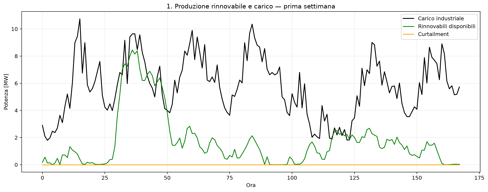
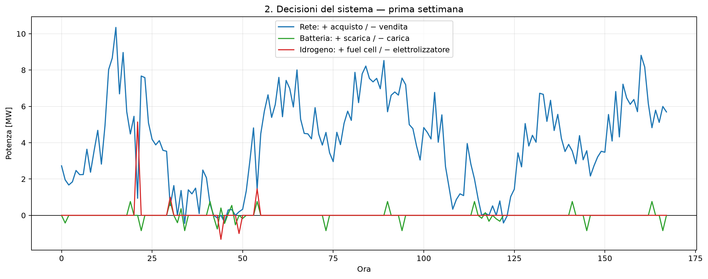
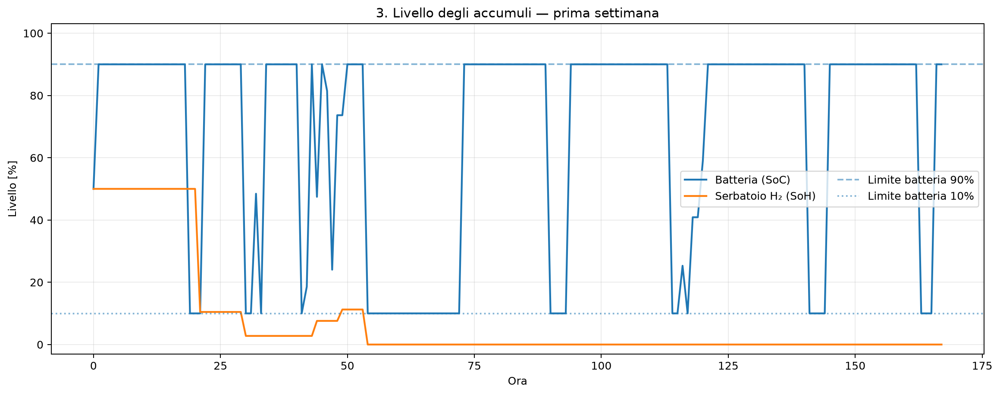
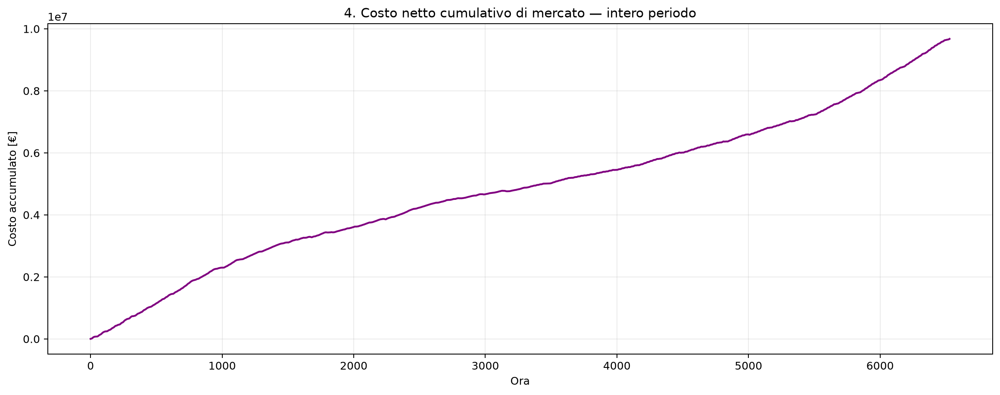
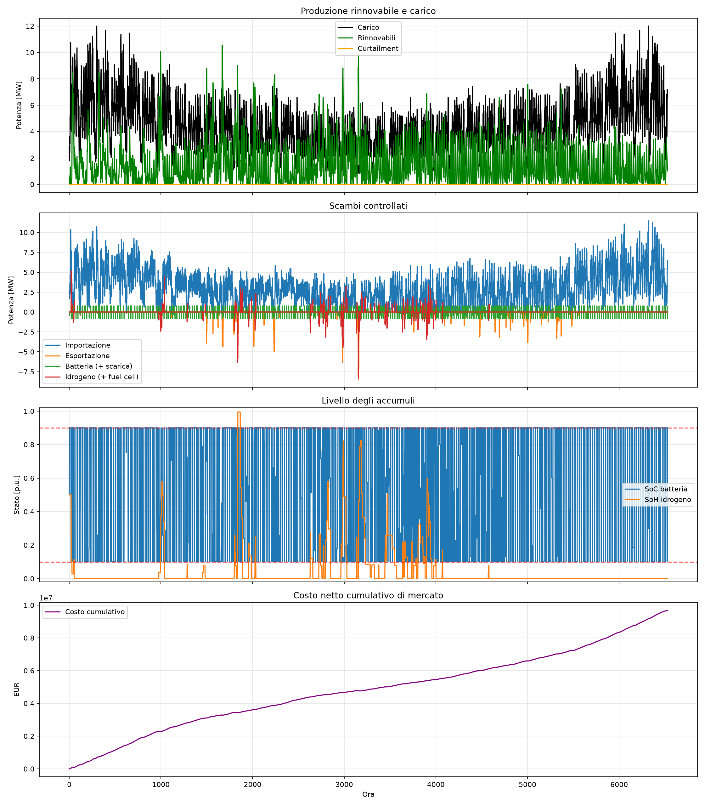

# Power Grid Optimization — Project 16

Corso **Innovazione e trasformazione digitale** (A.A. 2025-26), Modulo 2:
*Digitalizzazione e ottimizzazione nel settore dell'energia elettrica*
(Prof. Francesco Conte, UCBM). Implementazione del **Project 16** della
consegna (`Projects-3.pdf`): controllo MPC (Model Predictive Control) di un
sistema energetico industriale con rinnovabili, batteria, elettrolizzatore e
fuel cell.

## Guida rapida

```bash
cd "/Users/claudia/Desktop/Innovazione/power-grid-optimization"

# ambiente virtuale (consigliato, evita conflitti con altri progetti)
python3 -m venv .venv
source .venv/bin/activate

# dipendenze + solver open-source
pip install numpy scipy matplotlib pyomo highspy

# controllo che i dati si carichino bene, senza ottimizzare
python3 project16.py --data-dir "Data for projects-20260727" --check-data

# simulazione di una settimana (168h, default)
python3 project16.py --data-dir "Data for projects-20260727" --output-dir output_project16

# simulazione sull'intero anno (più lenta)
python3 project16.py --data-dir "Data for projects-20260727" --output-dir output_full --hours all
```

Risultati in `--output-dir`: `project16_results.csv` (tabella oraria) e
`project16_plots.png` (grafico riassuntivo).

## Iperparametri non dati dalla consegna

La consegna del Project 16 non specifica alcuni valori, lasciati come scelta
di modellazione:

| Parametro | Valore usato | Motivazione |
|---|---|---|
| Penale curtailment (`curtailment_penalty_eur_mwh`) | 1000 €/MWh | Nessun costo di curtailment è indicato in consegna (a differenza di altri progetti della stessa presentazione, che danno un `c_f` di test). Un valore alto rispetto ai prezzi di mercato (10-870 €/MWh nel dataset PUN) rende il curtailment quasi un'opzione di ultima istanza, in linea con l'obiettivo d) "minimize the curtailment" |
| SoC iniziale batteria | 0.50 | Non specificato; punto medio dell'intervallo ammesso [0.10, 0.90] |
| SoH iniziale idrogeno | 0.50 | Non specificato; punto medio dell'intervallo [0, 1] |

**Risultati ottenuti** con questi valori, simulazione di 168h (`--hours 168`,
default), SoC/SoH iniziali 0.50:

- Costo netto di mercato cumulato: **352 618 EUR**
- SoC: sempre entro **[0.10, 0.90]** (vincolo rispettato in ogni ora)
- SoH: entro **[0, 0.50]** nel periodo simulato
- Errore massimo sul bilancio di potenza: **~1e-16 MW** (nullo, a meno di
  precisione numerica) → il modello soddisfa esattamente il vincolo di
  bilancio in ogni ora
- Curtailment: praticamente assente nella settimana simulata, coerente con
  la penale elevata scelta

## Schema dell'impianto (consegna)

```
                         GRID
                          |
                     Pi - Pe
                          |
RES (Ppv+Pw) --Pres-Pc-- BUS ---Pul--- Buildings (carico non controllabile)
                          |
              +-----------+-----------+
              |                       |
         Pch - Pdsc               Pfc / Pely
          BATTERY              FUEL CELL <-HSS-> ELECTROLYZER
```

- **RES**: PV 4 MW + eolico 8 MW → `P_res = P_pv + P_w`, con possibilità di curtailment `P_c`
- **Rete**: import max 12 MW, export max 10 MW
- **Batteria**: 1 MW / 1 MWh, η_carica = η_scarica = 0.95
- **Sistema a idrogeno (HSS)**: accumulo 20 MWh; elettrolizzatore e fuel cell da 10 MW (min 1 MW), η_ely = 0.73, η_fc = 0.65
- **Carico (buildings)**: potenza nominale 12 MW (`P_ul`)

## Obiettivi di controllo (dalla consegna)

a) minimizzare il costo / massimizzare il ricavo del sistema industriale;
b) soddisfare il carico non controllabile (`P_ul`);
c) mantenere lo State of Charge della batteria tra il 10% e il 90%;
d) minimizzare il curtailment `P_c` delle rinnovabili.

**Assunzioni**: Δt = 1 h; a ogni istante k sono misurati `P_pv(k)`, `P_w(k)`,
`SoC(k)`, `SoH(k)`, `P_ul(k)`; sono note le previsioni di `P_pv`, `P_w`,
`P_ul` e i prezzi di acquisto/vendita per le successive 24h → schema MPC a
orizzonte scorrevole (receding horizon), che risolve un problema di
ottimizzazione a 24h e applica solo la decisione della prima ora.

## Dataset (da consegna)

| Grandezza | File | Note |
|---|---|---|
| `P_pv`, `P_w` | `res_1_year_pu.mat` | valori p.u., da moltiplicare per le potenze nominali indicate |
| `P_ul` | `buildings_load.mat` | valori già coerenti col nominale 12 MW di questo progetto (max = 12000 kWh/h) |
| `c_l` (prezzo import) | fasce F1=0,53276 / F2=0,54858 / F3=0,46868 [€/kWh] | profilo giornaliero fisso |
| `p_e` (prezzo export) | `PUN_2022.mat` | prezzo orario di mercato (PUN) |

I file `.mat` si trovano in `Data for projects-20260727/` (vedi anche il
`readme.txt` incluso per il formato completo di tutte le variabili
disponibili nel dataset del corso).

## Struttura della repo

```
Projects-3.pdf                   Consegna ufficiale del corso (tutti i progetti 1-16)
project16.py                     Implementazione: dati, modello MPC (Pyomo), simulazione, plotting
Data for projects-20260727/      Dataset di input (.mat) forniti dal corso
docs gen/                        Slide del corso ed esercizi Pyomo di riferimento
output_project16/                Output di una prima esecuzione (CSV + grafico)
output_project16_2/              Output di esecuzioni successive
  ├── full/                      Simulazione sull'intero anno
  │   └── grafici_spiegati/      I 4 pannelli come immagini singole (vedi "I grafici")
  └── week/                      Simulazione su una settimana (168 ore)
esperimenti_anno_highs/          Anno intero, 4 scenari, solver HiGHS
esperimenti_anno(gurobi)/        Anno intero, 4 scenari, solver Gurobi
```

## Modello implementato (`project16.py`)

Il modello Pyomo (MILP) riproduce lo schema e gli obiettivi della consegna:

- **Funzione obiettivo**: costo netto di mercato (acquisto − vendita) più una
  penale sul curtailment (obiettivi a e d)
- **Vincolo di bilancio di potenza**: rinnovabili (al netto del curtailment)
  + import + fuel cell + scarica batteria = carico + export + elettrolizzatore
  + carica batteria (obiettivo b)
- **SoC batteria** vincolato in [0.10, 0.90] (obiettivo c), con variabili
  binarie che impediscono carica/scarica simultanee e import/export simultanei
- **SoH idrogeno** (stato dell'accumulo H₂) con vincoli di potenza minima/massima
  su elettrolizzatore e fuel cell, mutuamente esclusivi

Ad ogni ora dell'MPC si risolve il problema sull'orizzonte di 24h e si applica
solo la prima decisione, aggiornando SoC/SoH reali prima di passare all'ora
successiva.

## Requisiti

- Python ≥ 3.10
- `numpy`, `scipy`, `matplotlib`
- `pyomo` + un solver MILP (HiGHS via `highspy`, oppure CBC/GLPK/Gurobi)

Senza Pyomo lo script funziona comunque in modalità `--check-data`.

## Utilizzo

```bash
python3 project16.py --data-dir "Data for projects-20260727" --output-dir output_project16 --hours 168
```

> Il default di `--data-dir` nello script punta a un percorso assoluto
> (`/Users/claudia/Desktop/Innovazione/Data for projects-20260727`) diverso
> dalla cartella dati presente in questa repo. Specificare sempre
> `--data-dir "Data for projects-20260727"` (percorso relativo alla repo).

| Argomento | Default | Descrizione |
|---|---|---|
| `--data-dir` | percorso assoluto codificato | Cartella con i file `.mat` |
| `--output-dir` | `output_project16` | Cartella per CSV e grafico |
| `--hours` | `168` | Ore da simulare, oppure `all` per l'intero dataset |
| `--solver` | `auto` | `auto`, `gurobi`, `appsi_highs`, `highs`, `cbc`, `glpk` |
| `--soc-initial` | `0.50` | Stato di carica iniziale batteria |
| `--soh-initial` | `0.50` | Livello iniziale idrogeno |
| `--check-data` | — | Verifica solo il caricamento dei dataset, senza ottimizzare |

## Output

Per ogni esecuzione vengono generati in `--output-dir`:

- `project16_results.csv`: decisione e stato per ogni ora simulata (potenze
  scambiate, SoC/SoH, costi orari e cumulativi, errore di bilancio)
- `project16_plots.png`: un'unica figura con i quattro pannelli descritti sotto
  (funzione `create_plots` in `project16.py`)

## I grafici

Ogni esecuzione produce la stessa figura a **quattro pannelli in colonna**, con
asse x = **ora della simulazione** (0–168 per la settimana, 0–6529 per l'anno).
La cartella `grafici/` contiene gli stessi
quattro pannelli come immagini separate, con i primi tre "zoomati" sulla prima
settimana per leggibilità e il quarto sull'intero anno.

### 1. Produzione rinnovabile e carico



Potenza in MW, tre linee:

| Linea | Significato |
|---|---|
| **Nera – Carico** | `P_ul`, la domanda dell'edificio, non controllabile: va sempre soddisfatta (obiettivo b). Oscilla tra ~2 e ~12 MW con ciclo giorno/notte. |
| **Verde – Rinnovabili** | `P_pv + P_w` effettivamente usata (PV 4 MW + eolico 8 MW). Molto variabile, spesso sotto il carico. |
| **Arancione – Curtailment** | Energia rinnovabile **sprecata** `P_c`. Resta incollata a zero: il sistema non butta mai via rinnovabile. |

Quando la verde sta sotto la nera manca energia → serve import o scarica degli
accumuli. Quando la verde supererebbe la nera, l'eccesso va in
batteria/idrogeno/export invece che in curtailment.

### 2. Scambi controllati (decisioni del sistema)



Sono le **decisioni** del controllore MPC. La linea orizzontale a 0 è il
riferimento; ogni curva ha segno:

| Linea | Sopra lo zero (+) | Sotto lo zero (−) |
|---|---|---|
| **Blu – Rete** | importazione (max 12 MW) | esportazione (max 10 MW) |
| **Verde – Batteria** | scarica | carica |
| **Rossa – Idrogeno** | fuel cell (H₂ → energia) | elettrolizzatore (energia → H₂) |

La somma di tutti i contributi più le rinnovabili chiude esattamente il
**bilancio di potenza** ogni ora (errore ~1e-16 MW). In pratica domina il
**blu positivo**: il sistema vive quasi sempre di import perché le rinnovabili
non bastano. Batteria e idrogeno danno contributi piccoli e sporadici, per
sfruttare i prezzi orari.

### 3. Livello degli accumuli



Stato di carica in % (nel `project16_plots.png` è in p.u. 0–1):

| Linea | Significato |
|---|---|
| **Blu – SoC batteria** | stato di carica della batteria (1 MWh). |
| **Arancione – SoH idrogeno** | livello del serbatoio H₂ (20 MWh). |
| **Linee tratteggiate/punteggiate** | limiti **10% e 90%** imposti alla batteria (obiettivo c). |

La SoC **rimbalza di continuo tra 10% e 90%**: la batteria è piccola, si
riempie/svuota in un'ora ed è usata come cuscinetto ai limiti, senza mai
uscire dalla fascia ammessa → vincolo sempre rispettato. La SoH parte da 50%,
viene consumata nei primi giorni e poi resta **a zero**: con rendimenti bassi
(η 0.73 / 0.65) e potenza minima 1 MW, l'idrogeno conviene poco e resta
inutilizzato.

### 4. Costo netto cumulativo di mercato



Somma progressiva di (costo import − ricavo export) ora per ora.

- **Settimana**: da 0 a **~352 600 EUR** in 168 h, quasi lineare con qualche
  gradino nelle ore care.
- **Anno**: sale a **~9,68 milioni EUR**, curva quasi retta con lieve
  accelerazione finale (inverno → carico e prezzi più alti). Sempre crescente:
  il sistema è nel complesso un compratore netto di energia.

### Simulazione sull'intero anno e confronto tra scenari



Le cartelle `esperimenti_anno_highs/` e `esperimenti_anno(gurobi)/` contengono
gli stessi quattro pannelli su **6529 ore** (un anno) in quattro scenari, con
due solver (HiGHS open-source e Gurobi commerciale):

| Scenario | SoC / SoH iniziali | Variante | Costo finale (HiGHS) |
|---|---|---|---|
| **A_baseline** | 0.50 / 0.50 | — | 9 676 296 € |
| **B_vuoto** | 0.10 / 0.00 | accumuli scarichi | 9 680 059 € |
| **C_pieno** | 0.90 / 1.00 | accumuli pieni | 9 672 533 € |
| **D_penalita_bassa** | 0.90 / 1.00 | penale curtailment λ = 0.01 | 9 672 511 € |

Risultati (`confronto_curtailment.csv`):

- **Curtailment = 0** in tutti e quattro gli scenari, tutto l'anno, con
  entrambi i solver — anche in D, dove la penale è quasi azzerata: su base
  annuale batteria + idrogeno + export bastano sempre ad assorbire la
  rinnovabile.
- Le condizioni iniziali contano pochissimo: tra il migliore (C) e il peggiore
  (B) ci sono **~7 500 € su 9,7 M€, meno dello 0,1%**.
- **HiGHS e Gurobi danno risultati quasi identici** → non serve un solver a
  pagamento.
- Nel pannello 3, sull'anno, la SoC appare come una fascia blu fitta di
  striature verticali: la batteria cicla tra 10% e 90% migliaia di volte.

L'unico caso di curtailment reale si osserva nel test sintetico
`ultimo_test.py` (rinnovabile 15 MW costante, carico 2 MW, accumuli pieni): lì
il modello spreca esattamente 15 − 2 − 10 = **3 MW**, il valore atteso,
confermando che la formulazione è corretta.

## Risoluzione problemi

- **`ModuleNotFoundError: No module named 'pyomo'`**: eseguire
  `pip install pyomo highspy` nell'ambiente virtuale attivo.
- **`Nessun solver disponibile`**: nessuno tra Gurobi/HiGHS/CBC/GLPK è
  installato o trovato da Pyomo; installare `highspy` (solver open-source
  sufficiente per questo modello) oppure specificare `--solver` esplicitamente.
- **`File non trovato`**: il percorso passato a `--data-dir` non è corretto;
  usare il percorso relativo `"Data for projects-20260727"` dalla root della repo.
